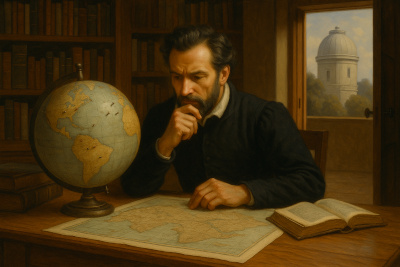

## The Illusion of Probability: On Relearning How God Governs the World

<!-- TODO: reframe from my own perspective instead of projecting on others -->
It has long struck me that even devoted, earnest Christians: people who profess
that God governs all things, often operate from a quieter, subconscious
worldview that resembles something far more modern and far less theological:
the world as a sea of probabilities.

<!-- TODO: consider the viewpoint that believes in the core randomness of 
events as a way to give God a way out of the responsibility for evil and
tragedy -->
We speak the language of faith, yet many of us **feel** the world as if it were
ultimately shaped by randomness. Life becomes a kind of vast statistical
ocean: particles colliding, circumstances drifting, opportunities opening or
closing according to probabilistic winds. And in this ocean, God becomes the
One who occasionally steps in to redirect the current, offer a timely rescue,
or make the improbable somehow come to pass. The default state remains chance;
God is the exception.

Even the writer of *Ecclesiastes* seems to flirt with this view: *“Time and
chance happen to them all.”* And so, almost without noticing, Christians begin
to internalize a worldview where life is fundamentally unpredictable, where
outcomes are essentially stochastic unless God interrupts. We may not say this
aloud, but our anxieties reveal it, our posture toward the future reveals it,
and our attempts at self-protection reveal it. We live *as if* God occasionally
intervenes but mostly watches.

Yet the more I live, the more I have come to believe this is a deeply
insufficient way to understand reality. It is not how Scripture describes God’s
relationship to creation, nor is it consistent with the deep assurance the
saints carried: in plague, in famine, in persecution, in the silence of
unfulfilled hopes.

A better worldview, truer, firmer, and ultimately more beautiful, is this:

**Nothing is left to chance. Not a single thread of history is unmanaged. Every
outcome, near and distant, bears the shape of God’s hand.**

The world is not machinery. It is **Providence**: living, personal, patient,
endlessly intricate. Providence is the hospitality of a God who designs the
story with the care of an artist, the wisdom of a sage, and the love of a
Father.

Under this worldview, “chance” is only the name given to patterns too complex
for us to trace. But it is never the name for God’s absence.

The absence of obvious divine action does not mean randomness reigns; it often
means only that we are still standing too close to the tapestry. If we step
back decades later—sometimes even into eternity—we find that the threads that
once looked like knots and tangles have become the very strokes of meaning that
shaped our hope.

Hope, in this worldview, is not naïve optimism. It is not the gamble of a
believer placing spiritual chips on a table and hoping the dice land in their
favor. Hope becomes something sturdier, more ancient: a trust that God is
already at work in the roots of our future, weaving outcomes we cannot yet
imagine.

And even if the fulfillment of that hope lives many years down the road, or
even after death, it makes no difference. Providence is not in a hurry. God
feels no pressure from time, because time itself bends to His will.

To believe this—truly, deeply—is to feel the scaffolding beneath the world
shift. Anxiety loosens. Prayer becomes less desperate and more intimate. Our
posture toward the future becomes less fearful and more expectant. We begin to
walk through life not as victims of probability but as participants in a story
whose Author is incapable of being careless.

And slowly, the heart learns something extraordinary: Even when we cannot
perceive it, even when life looks indistinguishable from randomness, **God is
shaping every outcome of every situation.**

Chance is not the ground truth. Providence is.

And when we begin to see the world this way, not as a statistical field but as
a field tended by God’s own hand, life does not become easier, but it becomes
infinitely more meaningful. Hope no longer depends on the roll of history’s
dice. It depends on the God who holds the dice, the table, the universe, and
our stories in the same sustaining breath.
